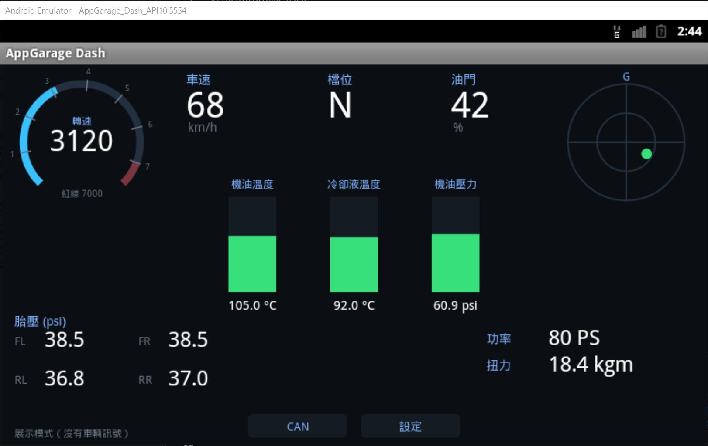

# AppGarage Dash


一套可直接在 **V37 Q50／Q60** 原廠 **Infiniti InTouch** 主機螢幕上運作的
**免轉接器車輛儀表板**。它能直接讀取車輛本身的 CAN 匯流排訊號，包括轉速、機油溫度、
**機油壓力**、冷卻液溫度、各輪胎壓、G 值、檔位、油門、功率等，
**不需要 OBD 轉接器、藍牙或手機**。




## ⚠️ 相容性——請先閱讀

**目標環境：**採用本專案逆向分析之 **Android 2.3.x** 版本 InTouch 主機的
**V37 Infiniti Q50／Q60**（客製化 **Android 2.3.7、API 10、x86** 車機）。
上游專案在 **2018 Q60 Red Sport 400 AWD（V37、VR30DDTT）**上開發及驗證；
隨附的公開 OBU 憑證，以及感測器類型到單位的校正資料，均來自該車韌體。

此 fork 的實車測試環境為 **Infiniti Q50 Hybrid（VQ35HR）**。目前仍在查找並確認
**引擎轉速、混合動力系統狀態、機油壓力與機油溫度**的正確訊號及換算方式；
上述項目目前尚無法正常顯示，不應將現有讀值視為可靠的車況資料。

**不保證適用於所有 Q50／Q60。**其他年份、地區及較新的 InTouch 硬體／軟體可能使用不同韌體
（不同作業系統、SoC 或 CAN 對應），因此應用程式可能無法啟動，或感測器編號及換算比例可能不正確。
如果你的主機不是上述 **Android 2.3.x InTouch**，請視為**尚未驗證**：只在相符的主機及
**你本人擁有的車輛**上執行，並以原車儀表核對換算結果是否合理。

## 運作原理

此 InTouch 主機在 Linux 導航介面底下執行客製化的 **Android 2.3.7（API 10、x86）**，
並提供「App Garage」環境。本應用程式能夠運作，主要基於以下兩點：

1. **車輛 CAN 匯流排會以標準 Android `Sensor` 形式提供**（`VS_ID_*`、廠商為「Ygomi」、
   感測器類型為 12–53）。任何應用程式都能透過一般的
   `SensorManager.getDefaultSensor(type)`、`registerListener`，再從
   `onSensorChanged(e).values[0]` 讀取資料。讀值需要
   `com.ygomi.permission.IVI_CAN_READ`；此權限等級為 *dangerous*，在 Android 2.3 上會自動授予
   一般自行簽署的應用程式。
2. Manifest 中的 **`ivi.isDistractive="false"`** 會將 `runningRestriction` 設為 0，
   讓應用程式在**行駛中仍可使用**（平台預設會將未標記的應用程式設為受限）。

本程式完全以 Java 撰寫、不含原生程式碼（可在 x86 CPU 上執行）、不需要 Google 服務，且可完全離線運作。

## 語言與顯示單位

點選儀表板底部的 **SETTINGS**，即可在不離開應用程式的情況下調整顯示設定。
設定會儲存在車機上，並於下次啟動儀表板時還原。

- 語言：English／繁體中文
- 引擎設定檔／轉速紅線：VR30DDTT 6800／VQ35HR 7000／VQ37VHR 7500 rpm
- 速度：mph／km/h
- 壓力：psi／kPa（套用於機油壓力與胎壓）
- 功率：kW／PS
- 扭力：Nm／kgm

介面翻譯獨立存放於 Java 原始碼之外的 `assets/i18n/en.json` 與
`assets/i18n/zh-TW.json`。儀表板啟動時只載入一次；若缺少某個鍵值，會先回退至英文，
再回退至鍵名。若要擴充其他語言，請新增 JSON 語系檔及對應的語言選項。

點選儀表板底部的 **CAN** 可開啟即時診斷畫面。畫面會列出 `SensorManager` 回報的所有感測器，
包括未知或自訂類型，並顯示其類型、名稱／廠商、原始值向量（最多四個欄位）、
觀察到的第一欄位範圍、平均更新頻率，以及目前狀態（`LIVE`、`STALE` 或 `NO DATA`）。
儀表板使用的訊號會標示為 `VR30 MAP`，其餘則標示為 `UNKNOWN`。
使用 PREV／NEXT 可瀏覽其他感測器頁面。在 VQ35 Hybrid 或任何非 VR30 車輛上，
應先以原始值為準，直到各項對應與換算比例都已在實車上驗證。

診斷畫面的標題列也提供 **SYSTEM** 頁面。它會以唯讀方式盤點 Binder 服務、已安裝套件、
Android 服務、Provider、Receiver 及相關權限；不會呼叫未知的 Binder 方法，也不會寫入 CAN。
符合關鍵字的項目會排列在前方，方便在無法匯出檔案的車機上直接拍照記錄。

SYSTEM 探測也會顯示 Android 是否提供藍牙介面卡、已配對裝置，以及可處理 APK 檔案的
`ACTION_SEND` 程式。這能在啟用任何匯出功能前，先確認藍牙 OPP 是否可行。

此外，它也會列出可見的網路介面／IP 位址、外部儲存空間及 USB／SD 掛載點、
可用／總容量，以及每個已安裝 APK 的檔案大小與讀寫權限。這些檢查全部維持唯讀，
用途是在複製任何系統套件前，先選定安全的匯出路徑。

## 在 Windows 上預覽

可使用名為 `AppGarage_Dash_API10` 的 Android 2.3.3（API 10）x86 AVD，
在沒有車輛的情況下執行儀表板。建置完成後雙擊 `preview.cmd`：它會啟動模擬器、等待 Android 開機、
安裝 `build/dash.apk`，並以 DEMO 模式開啟儀表板。AVD 已設定為車機的 800×480 橫向顯示；
若要維持可用效能，必須啟用硬體加速。

## 訊號與校正

原始感測器值是沒有標籤的浮點數；下列資料是在讀取訊號的 VR30DDTT 車輛上校正所得：

### VQ35HR Hybrid 實車觀察

本 fork 使用 **Infiniti Q50 Hybrid（VQ35HR）**進行實車測試。目前正持續比對原始 CAN
感測器資料，尚未找出能讓引擎轉速、混合動力系統狀態、機油壓力及機油溫度穩定正常運作的
完整對應與換算方式。因此，這些欄位目前屬於**開發中／尚未正常支援**，請勿用於判斷車況。

VQ35HR Hybrid 韌體使用相同的 Android 感測器類型編號，但不一定採用與 VR30DDTT 相同的校正方式。
在受測車輛靜止時，類型 15、16、12 與 32 分別回報負數占位值
（`-50`、`-0.098`、`-398`、`-408462.5`）。因此，選用 VQ35HR 設定檔時，
儀表板會將這些值顯示為 `--`；CAN 診斷畫面則會繼續顯示未經修改的原始值，供校正使用。

類型 13 在車輛中仍命名為 `VS_ID_ENGINE_RPM`，並繼續作為轉速來源。
混合動力系統處於 READY、但內燃機停止時，轉速為零可能是有效讀值。
類型 43 的名稱是 `VS_ID_DISTANCETOTALIZER`；除非取得更有力的實車擷取證據，否則不可用作轉速來源。

| 儀表 | 感測器 | 換算 | 備註 |
|---|---|---|---|
| 轉速 | 13 | 直接讀值 | 暖車怠速約 650（冷車／暖機時較高） |
| 冷卻液／機油溫度 | 14／15 | 直接讀值 °C | |
| **機油壓力** | 16 | 原始值 × 145 → **psi** | 暖車怠速約 22 psi（原始值為 MPa） |
| 速度 | 17 | 原始值 × 0.621 → **mph** | 原始值為 km/h |
| 扭力 | 12 | 約為 Nm | |
| 功率 | 32 | 原始值 × 1.047e-4 → **kW** | 原始值 = rpm × 扭力 |
| 四輪胎壓 | 36–39 | 直接讀值 **psi** | |
| 油門 | 23 | % | |
| 檔位 | 22 | 列舉值 | P=1、R=2、N=3、D=4、M1–M7=16–22（已在實車確認） |
| 橫向／縱向 G 值 | 20／21 | 原始值 | 假設滿刻度約為 1 g |

上述對應只適用於前述韌體；在其他車機上請僅將它們視為起點。
常數位於 [`GaugeView.java`](src/com/appgarage/dash/GaugeView.java) 頂部。

**無法取得的資料**（此車機的 CAN 未提供）：增壓／MAP、AFR／lambda、爆震、點火正時。
這些屬於只有 EcuTek 等 ECU 調校工具才會讀取的參數；本程式取得的是儀表組等級資料。

## 建置

需求：JDK、Android SDK 命令列工具（`build-tools;34.0.0` 與 `platforms;android-34`），
以及安裝 `cryptography` 的 Python 3（`pip install cryptography`，供 `.epk` 步驟使用）。
請透過 `JAVA_HOME` 與 `ANDROID_SDK` 環境變數指定工具鏈，或編輯 `build.sh` 開頭的兩行設定。

```sh
git clone https://github.com/bugjosh/appgarage-dash && cd appgarage-dash
bash build.sh          # -> build/dash.apk 與 build/dash.epk（可由 App Garage 載入）
```

APK 的 `minSdkVersion` 為 10，使用純 Dalvik（不含 `lib/`），並以持久保存的 `keystore.ks` 自行簽署。

## 安裝到車機

車機的 **App Garage** 只會安裝 USB 裝置中的 `.epk` 套件。`build.sh` 會使用
[`keys/obu_cert.pem`](keys/README.md) 中的**公開** OBU 憑證產生 `build/dash.epk`
（僅隨附公開憑證；不包含私鑰與韌體）。

**在電腦上**

1. 將 USB 隨身碟格式化為 **FAT32**。
2. 將 **`build/dash.epk`** 複製到隨身碟**根目錄**（App Garage 會掃描其中的 `.epk` 檔案）。

**在車內**（保持引擎運轉，儀表才會顯示即時資料）

3. 將隨身碟插入車機 USB 連接埠。若出現 *「USB music device detected… create or replace voice recognition data?」*，請選擇 **No**。
4. 啟動後稍候片刻；車機可能需要**最多一分鐘**完成載入，主畫面底部會顯示 **「Loading all apps」** 或類似文字。請等候訊息消失。
5. 在主畫面按一次**向右箭頭**，即可看到 **App Garage** 圖示；開啟它。
6. 選擇 **Install Apps via USB**。畫面會列出隨身碟中的應用程式；選擇 **AppGarage Dash**
   （或 **Install All Apps**），然後在 **Install this app?** 提示中選擇 **Install**。
7. 等候 **Installation from USB complete**／**Apps installed**；安裝途中不要拔除 USB
   （畫面會提示 *「Please do not remove the USB during installation」*）。
8. 從 App Garage（或主畫面捷徑）啟動 **AppGarage Dash**，儀表隨即開始顯示即時資料。

**更新方式：**若安裝檔的 `versionCode` 小於或等於已安裝版本，App Garage 會隱藏該候選項目。
因此，每次執行 `build.sh` 都會寫入更大的 `versionCode`（Unix 時間），讓新的 `dash.epk`
出現在清單中，並在**使用相同簽署金鑰**（`keystore.ks`）時覆蓋舊版。
若清單中沒有顯示，或你改用其他金鑰重新建置（全新 clone 會自行產生金鑰，且發布版 `.epk`
與自行建置版本不同），請先**解除安裝既有的「AppGarage Dash」**，再重新安裝。

> 上述選單文字取自 App Garage 韌體；你的車機文字應完全相同或十分接近。
> 隨附憑證可用於執行相符 InTouch 韌體的車機；使用不同韌體的車機必須提供自己的憑證
> （參閱 [`keys/README.md`](keys/README.md)）。請只在**你本人擁有的車輛**上載入軟體。

## 致謝

本專案仰賴其他人的前期成果才得以完成：

- **上游專案：**本專案由 [bugjosh/appgarage-dash](https://github.com/bugjosh/appgarage-dash)
  fork 並延伸開發；感謝 **bugjosh** 建立原始專案及公開相關研究成果。
- **韌體映像：**讓此平台得以理解的 Q50／Q60 系統映像，由 **@tdpequinox**
  在 **DCUFix** Discord 上擷取並分享，在此致謝。
- **App Garage 載入格式：**裝置端套件格式，以及應用程式的簽署／接受方式，均從該韌體研究得出。

## 免責聲明

僅供在**你本人擁有的車輛**上使用，風險由使用者自行承擔。請勿因觀看螢幕而分心駕駛。
本專案與 Infiniti、Nissan、Ygomi 或 Airbiquity 無關，且不包含任何專有金鑰、韌體或受著作權保護的素材。

## 授權

採用 MIT 授權，詳見 [LICENSE](LICENSE)。
